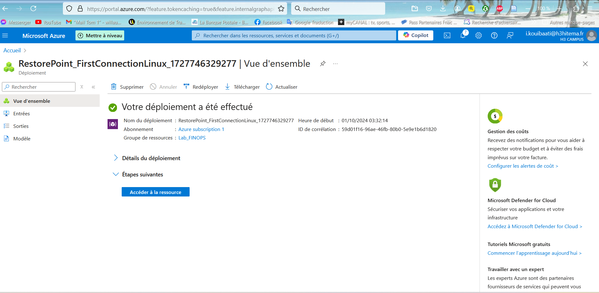

Lab 1: Creating and Managing Azure Virtual Machines (Linux)
Création Ressource Group + VM

Équivalent en Azure CLI

az vm create \
  --resource-group <VotreGroupeDeRessources> \
  --name <VotreNomDeVM> \
  --image UbuntuLTS \
  --admin-username <VotreNomUtilisateur> \
  --admin-password '<VotreMotDePasse>' \
  --size Standard_D2s_v3 \
  --public-ip-sku Standard

Connection ssh

!
 [alt text](<Capture d’écran 2024-10-01 030656.png>)
 
 