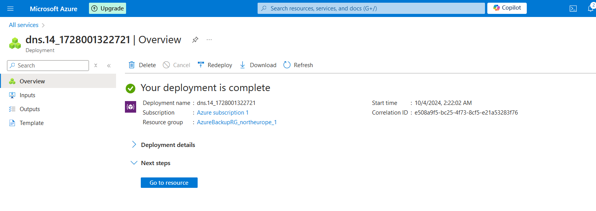

# Lab 14 : Configuration d'Azure DNS et de domaines personnalisés

## Étapes

### 1. Créer une zone DNS

```bash
az network dns zone create \
    --resource-group <Nom-du-groupe-de-ressources> \
    --name <Nom-du-domaine>
```

### 2. Ajouter un enregistrement A dans la zone DNS

```bash
az network dns record-set a add-record \
    --resource-group <Nom-du-groupe-de-ressources> \
    --zone-name <Nom-du-domaine> \
    --record-set-name <Nom-de-l'enregistrement> \
    --ipv4-address <Adresse-IP>
```

### 3. Ajouter un enregistrement CNAME dans la zone DNS

```bash
az network dns record-set cname set-record \
    --resource-group <Nom-du-groupe-de-ressources> \
    --zone-name <Nom-du-domaine> \
    --record-set-name <Nom-de-l'enregistrement> \
    --cname <Nom-cible>
```


### 3. Supprimer un enregistrement DNS

```bash
az network dns record-set delete \
    --resource-group <Nom-du-groupe-de-ressources> \
    --zone-name <Nom-du-domaine> \
    --name <Nom-de-l'enregistrement> \
    --type <Type-d'enregistrement>
```

---

