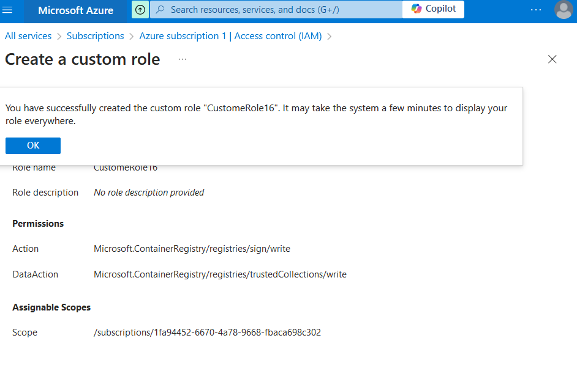

# Lab 16 : Gestion de l'accès basé sur les rôles (RBAC) dans Azure

## Étapes

### 1. Attribuer un rôle à un utilisateur

```bash
az role assignment create \
    --assignee <Adresse-email-de-l'utilisateur-ou-object-id> \
    --role <Nom-du-rôle> \
    --scope <ID-ou-ressource-de-scope>
```

### 2. Lister les attributions de rôles pour une ressource spécifique

```bash
az role assignment list \
    --resource-group <Nom-du-groupe-de-ressources> \
    --assignee <Adresse-email-ou-object-id>
```

### 3. Créer un rôle personnalisé

1. Créer un fichier JSON décrivant le rôle personnalisé, par exemple `custom-role.json` :

```json
{
  "Name": "CustomRole",
  "IsCustom": true,
  "Description": "Description du rôle personnalisé",
  "Actions": [
    "Microsoft.Storage/*/read",
    "Microsoft.Network/*/read",
    "Microsoft.Compute/virtualMachines/start/action",
    "Microsoft.Compute/virtualMachines/restart/action"
  ],
  "NotActions": [],
  "AssignableScopes": ["/subscriptions/<ID-de-la-souscription>"]
}
```

2. Créer le rôle personnalisé avec la commande suivante :

```bash
az role definition create --role-definition custom-role.json
```

### 4. Modifier un rôle existant

1. Exporter le rôle existant dans un fichier JSON :

```bash
az role definition list --name <Nom-du-rôle> > role.json
```

2. Modifier le fichier `role.json` en fonction des permissions souhaitées, puis réimporter le rôle modifié :

```bash
az role definition update --role-definition role.json
```

### 5. Supprimer une attribution de rôle

```bash
az role assignment delete \
    --assignee <Adresse-email-ou-object-id> \
    --role <Nom-du-rôle> \
    --scope <ID-ou-ressource-de-scope>
```

### 6. Lister tous les rôles disponibles

```bash
az role definition list --output table
```

