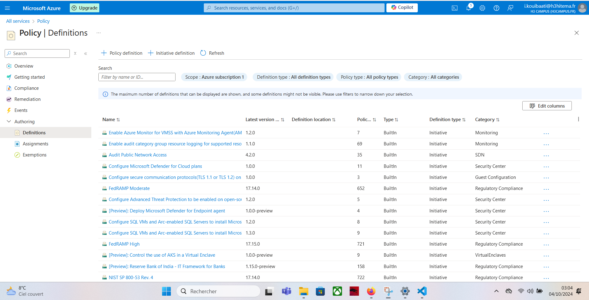

# Lab 17 : Implémentation de la politique et de la gouvernance Azure

## Étapes

### 1. Créer une définition de politique Azure

1. Créer un fichier JSON pour la définition de la politique, par exemple `policy-definition.json` :

```json
{
  "properties": {
    "displayName": "Policy Name",
    "description": "Description de la politique",
    "policyRule": {
      "if": {
        "field": "location",
        "notEquals": "francecentral"
      },
      "then": {
        "effect": "deny"
      }
    }
  }
}
```

2. Créer la politique en utilisant le fichier de définition :

```bash
az policy definition create \
    --name <Nom-de-la-politique> \
    --display-name "Nom de la politique" \
    --description "Description de la politique" \
    --rules policy-definition.json \
    --mode All
```

### 2. Lister les définitions de politique

```bash
az policy definition list --output table
```

### 3. Attribuer une politique à un groupe de ressources ou à une souscription

```bash
az policy assignment create \
    --name <Nom-de-l'attribution> \
    --policy <Nom-ou-ID-de-la-politique> \
    --scope <Scope-à-appliquer>
```

### 4. Lister les politiques assignées à un groupe de ressources

```bash
az policy assignment list \
    --resource-group <Nom-du-groupe-de-ressources> \
    --output table
```

### 5. Supprimer une attribution de politique

```bash
az policy assignment delete \
    --name <Nom-de-l'attribution> \
    --scope <Scope-à-appliquer>
```

### 6. Créer une initiative (ensemble de politiques)

1. Créer un fichier JSON pour l'initiative, par exemple `initiative-definition.json` :

```json
{
  "properties": {
    "displayName": "Nom de l'initiative",
    "description": "Description de l'initiative",
    "policyDefinitions": [
      {
        "policyDefinitionId": "/subscriptions/<ID-souscription>/providers/Microsoft.Authorization/policyDefinitions/<ID-politique-1>"
      },
      {
        "policyDefinitionId": "/subscriptions/<ID-souscription>/providers/Microsoft.Authorization/policyDefinitions/<ID-politique-2>"
      }
    ]
  }
}
```

2. Créer l'initiative à partir du fichier JSON :

```bash
az policy set-definition create \
    --name <Nom-de-l'initiative> \
    --display-name "Nom de l'initiative" \
    --description "Description de l'initiative" \
    --definitions initiative-definition.json
```

### 7. Attribuer une initiative

```bash
az policy assignment create \
    --name <Nom-de-l'attribution> \
    --policy-set-definition <Nom-ou-ID-de-l'initiative> \
    --scope <Scope-à-appliquer>
```

---

### 8. Rapport Cpmiance avant et après Remedization 


