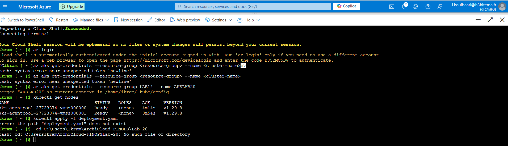

Lab 20: Deploying Azure Kubernetes Service (AKS)
Étape 1 : Configurer un cluster AKS

    Créez un cluster AKS dans le portail Azure. Les paramètres du cluster peuvent être configurés via l'interface graphique.
    

az aks create \
  --resource-group <nom_du_groupe> \
  --name AKSClusterLab20 \
  --node-count 3 \
  --enable-addons monitoring \
  --generate-ssh-keys

  

Étape 2 : Déployer une application conteneurisée à l'aide de manifestes Kubernetes

    Téléchargez les fichiers deployment.yaml et service.yaml dans la section Kubernetes resources du portail Azure.
    Utilisez l'option Apply pour déployer l'application conteneurisée.

Voici les fichiers YAML utilisés :
deployment.yaml

Lab-20/deployment.yaml

service.yaml

apiVersion: v1
kind: Service
metadata:
  name: nginx-service
spec:
  selector:
    app: nginx
  ports:
  - protocol: TCP
    port: 80
    targetPort: 80
    nodePort: 30007
  type: NodePort

Étape 3 : Mettre à l'échelle les applications et gérer les pods

    Dans l'interface Kubernetes resources, ajustez le nombre de réplicas à partir du déploiement en modifiant les paramètres.

kubectl scale --replicas=4 deployment/nginx-deployment

kubectl get pods

Étape 4 : Mettre en œuvre des politiques réseau pour la communication entre pods
    
    Appliquez les politiques réseau en téléchargeant le fichier networkpolicy.yaml et en utilisant l'option Apply.
